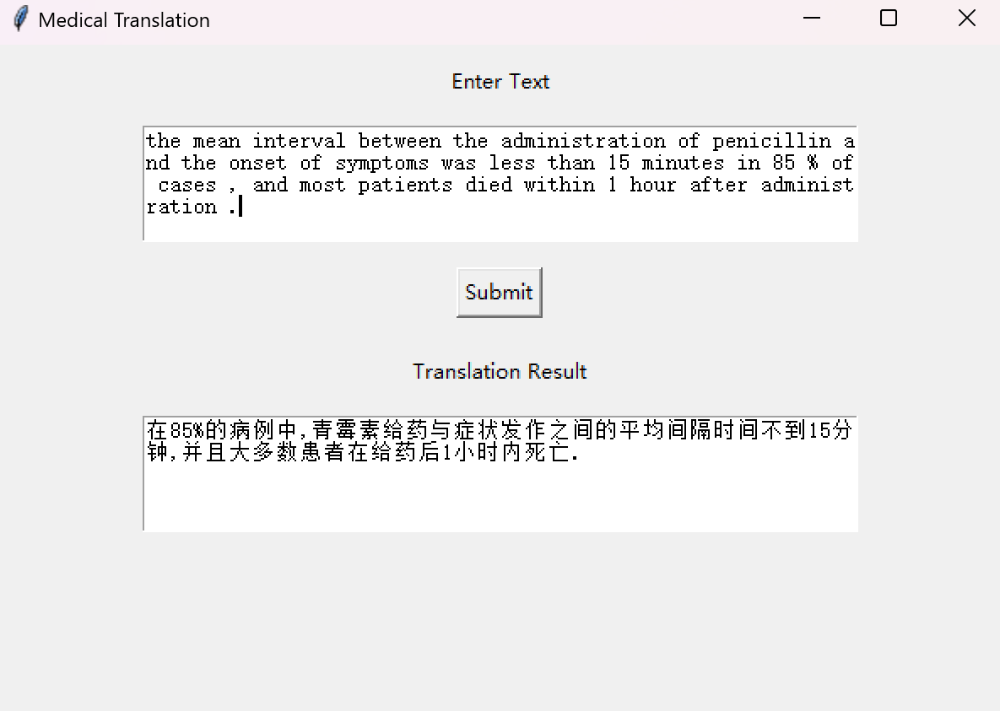

# Transformer Medical Translation System

English / [中文](readme_zh.md)

↑ 点击切换语言

This project uses a **Seq2Seq** model based on the **Transformer** architecture to perform transfer learning on a parallel corpus of Chinese and English texts collected from the **New England Journal of Medicine**, to make the model better suited for professional medical translation from English to Chinese.

A simple GUI interface is implemented using **Tkinter**, allowing users to conveniently perform English-to-Chinese translation operations.



## Table of Contents

- [Multilingual Comments](#Multilingual-Comments)
- [Dataset](#Dataset)
- [File Structure](#File-Structure)
- [Contributions](#Contributions)

## Multilingual Comments

To make the code easier to understand for developers from different language backgrounds, the comments in this project are provided in both English and Chinese.

## Dataset

The dataset used in this project is sourced from [Github](https://github.com/boxiangliu/ParaMed).

Please download the dataset directly from the provided link and place it in the data folder.

## File Structure

The project's file structure is as follows:

```c++
Medical_Translation/
│
├── data/ 
│
├── utils(en/zh)/
│   ├── translation_dir/
│   ├── __init__.py
│   ├── GUI.py
│   └── process.ipynb
└── main.py 
```

## Contributions

All forms of contributions are welcome! Whether it’s reporting bugs or making suggestions, your help is greatly appreciated!!
