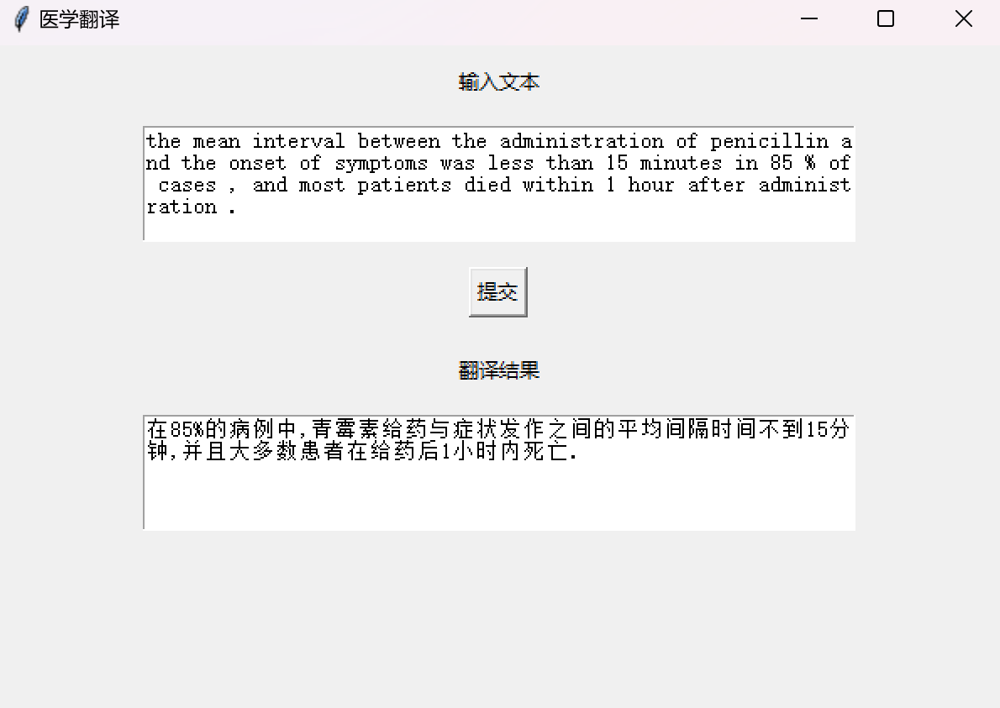

# Transformer 医学翻译系统

[English](readme.md)  /  中文

↑ Click to switch language

本项目通过 **Transformer** 架构下的 **Seq2Seq** 模型 对 **新英格兰医学杂志** 中爬取的中英文平行语料库进行迁移学习 从而使得该模型更加适合将医学相关内容从英文翻译成中文

同时使用 **Tkinter** 实现了一个简单的GUI界面 方便用户进行英文到中文的翻译操作



## 目录

- [多语言注释](#多语言注释)
- [数据集](#数据集)
- [文件结构](#文件结构)
- [贡献](#贡献)

## 多语言注释

为了让不同语言背景的开发者更容易理解代码 本项目的注释提供了英文和中文两种版本

## 数据集

本项目使用的数据集来源于 [Github](https://github.com/boxiangliu/ParaMed)

请直接从提供的链接下载数据集 并将其放置在data文件夹中

## 文件结构

项目的文件结构如下

```c++
Medical_Translation/
│
├── data/ 
│
├── utils(en/zh)/
│   ├── translation_dir/
│   ├── __init__.py
│   ├── GUI.py
│   └── process.ipynb
└── main.py 
```

## 贡献

欢迎所有形式的贡献！无论是报告错误还是提出建议 非常感谢！！
